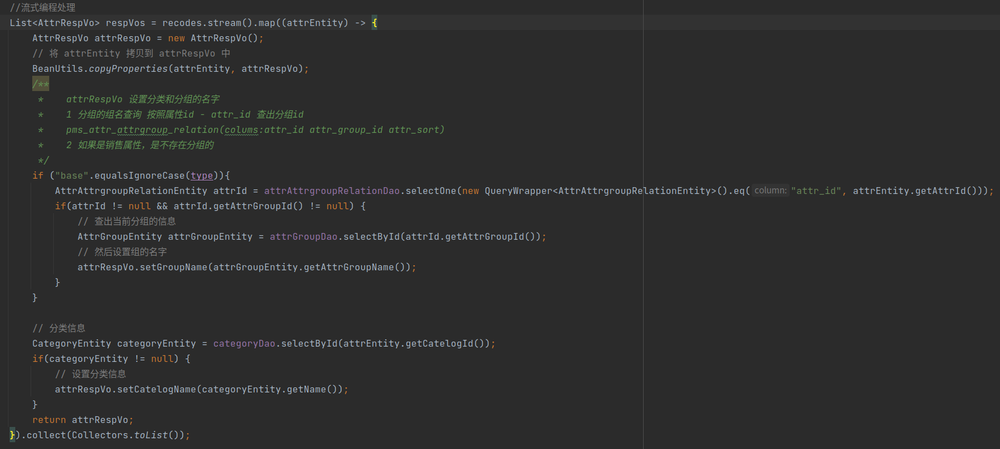

流式函数的使用。

前文的page等定义

```java
 /**
         * 使用 this.page 方法将分页条件 params 封装成 IPage 参数，如下：
         *  public IPage<T> page(IPage<T> page, Wrapper<T> queryWrapper) {
         *          return this.baseMapper.selectPage(page, queryWrapper);
         *  }
         */
        IPage<AttrEntity> page = this.page(
                new Query<AttrEntity>().getPage(params), queryWrapper );


        /**
         * 查询出分页结果以后，再查询一遍分组信息和分类信息 pms_attr pms_attr_attrgroup_relation
         */
        PageUtils pageUtils = new PageUtils(page);
        List<AttrEntity> recodes = page.getRecords();
```




我的疑问：stream()到底是什么？怎样使用的？数据发生了怎样的变化？

官方文档：

Collection.java:


deepl翻译：

```markdown
返回一个以这个集合为源的顺序流。
当 spliterator() 方法不能返回 IMMUTABLE、CONCURRENT 或 Late-binding 的spliterator 时，应该重写这个方法。(详见 spliterator())。)
返回：在这个集合中的元素上的一个顺序流。
实现要求：
默认实现是从集合的 Spliterator 中创建一个连续的 Stream。
```


deepl翻译

```
在这个集合中的元素上创建一个Spliterator。实现应该记录由splitator报告的特征值。如果spliterator报告Spliterator.SIZED，并且这个集合不包含任何元素，则不需要报告这些特征值。
默认的实现应该被那些可以返回更有效的 spliterator 的子类所覆盖。为了保留 stream() 和 parallelStream() 方法的预期懒惰行为，spliterator 应该具有 IMMUTABLE 或 CONCURRENT 的特性，或者是晚期绑定的。如果这些都不实用，覆盖类应该描述分裂器的绑定和结构干扰的文件化策略，并且应该覆盖 stream() 和 parallelStream() 方法以使用分裂器的 Supplier 来创建流，就像这样：
 Stream<E> s = StreamSupport.stream(() -> spliterator(), spliteratorCharacteristics)
这些要求确保由stream()和parallelStream()方法产生的流将反映终端流操作开始时的集合的内容。
返回：
在这个集合中的元素上的Spliterator
实现要求：
默认实现是从集合的迭代器中创建一个晚期绑定的分裂器。这个分割器继承了集合的迭代器的故障快速属性。
创建的Spliterator报告Spliterator.SIZED。
实施说明：
创建的Spliterator会额外报告Spliterator.SUBSIZED。
如果一个splitator不包括任何元素，那么除了SIZED和SUBSIZED之外，报告额外的特征值并不能帮助客户控制、专门化或简化计算。然而，这确实能够使空集合共享使用一个不可变的和空的分割器实例（见Spliterators.emptySpliterator()），并使客户能够确定这样的分割器是否覆盖了任何元素。
```


StreamSupport.java 中的 stream():


deepl翻译：

```markdown
从 Spliterator 创建一个新的顺序或平行流。
只有在流管道的终端操作开始后，才会对分割器进行遍历、分割或查询估计大小。
强烈建议 spliterator 报告 IMMUTABLE 或 CONCURRENT 的特性，或者是晚期绑定。否则，应该使用stream(Supplier, int, boolean)来减少对源的潜在干扰范围。更多细节请参见非干扰性。
参数：
spliterator - 描述流元素的Spliterator parallel - 如果为true，那么返回的流是一个并行流；如果为false，返回的流是一个顺序流。
返回：
一个新的顺序或平行流
```


