添加一些自己的功能

# 1 分页

使用分页插件

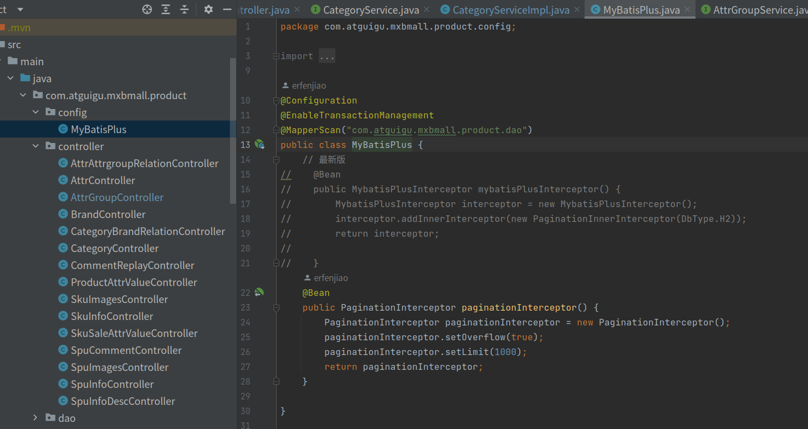

# 2 品牌的模糊查询功能

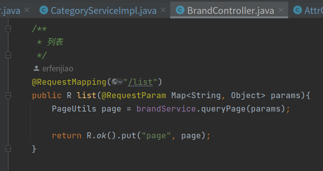

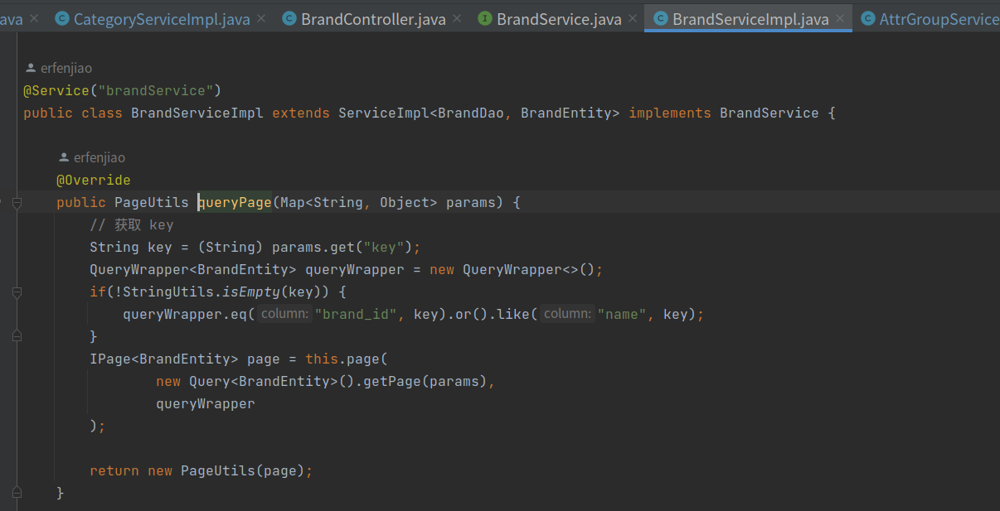

# 关联分类

商城中每件物品都需要自己的分类，例如华为，小米等在手机分类下。但华为这个品牌不止有手机，还有电脑、电视等。

所以一个品牌对应多个分类，每个分类下也会有多个品牌。

是多对多的关系。

## 获取品牌关联的分类

文档接口

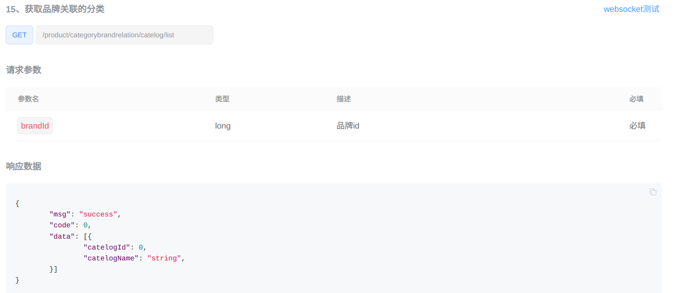

数据库表，获取响应数据中需要的catelogId catelogName，都在下面的表格中。

数据库表设计细节：添加了brand_name catelog_name，而不是依据 id 去对应的表中查询。

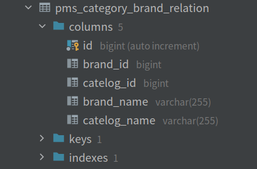

后端接口，直接查表

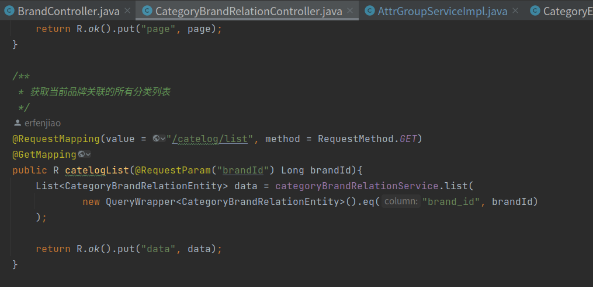

## 保存品牌关联的分类

前端点击保存按钮，会向后端传送品牌Id（brandId）与分类Id（catelogId）

因数据库表设计细节：添加了brand_name catelog_name，而不是依据 id 去对应的表中查询。所以需要重新设计 save 方法

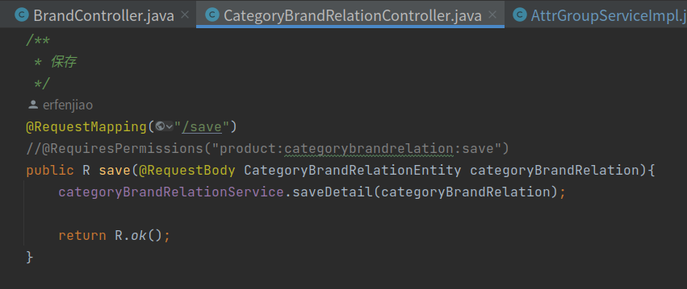

saveDetail 实现步骤：

首先获取到两个id，然后根据id查询到品牌名和分类名

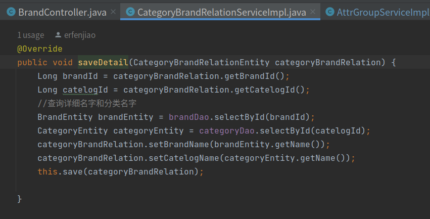

## 冗余数据同步

因数据库表设计细节：添加了brand_name catelog_name，而不是依据 id 去对应的表中查询。

而如果在 pms_brand pms_catelog 表中修改了名字，这张表中的数据也需要修改

### 品牌更新

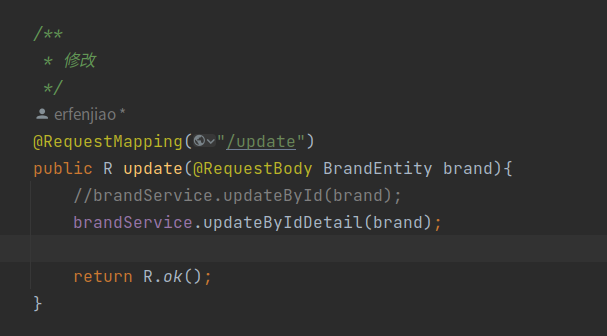

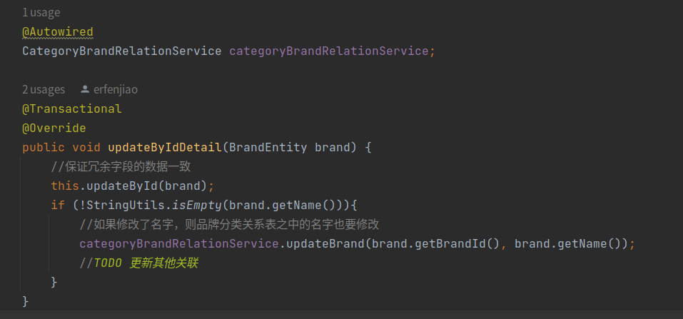

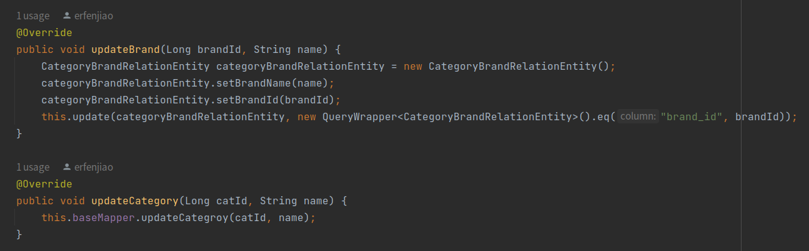

### 分类更新

