# 属性分组

## 前端组件抽取 && 父子组件交互

### 三级分类后端接口

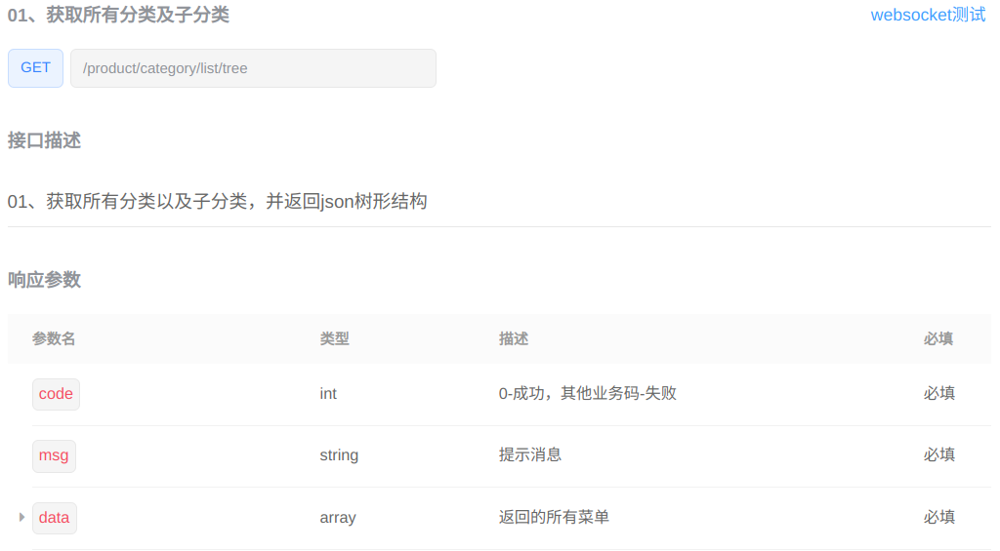

### 属性分组前端

左右布局。左边三级分类，右边查询

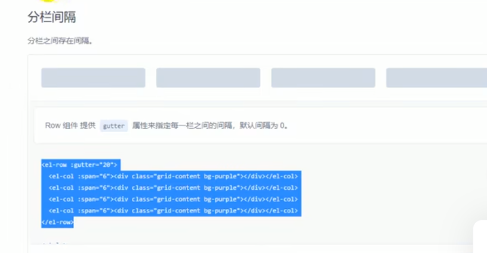

```
<el-row> 
```


#### 左边三级分类

/views/modules/common/category.vue

el-tree 中，使用catId区分节点，el-tree组件名字叫做menuTree

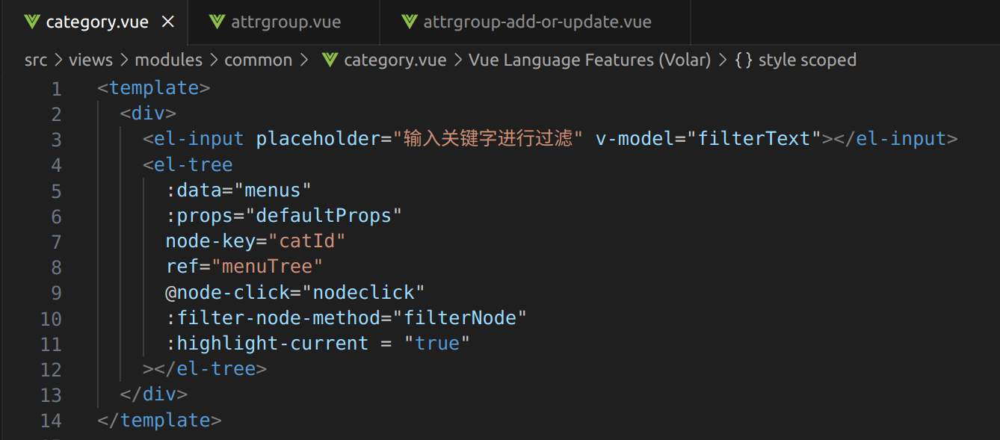


data 数据结构体如下：

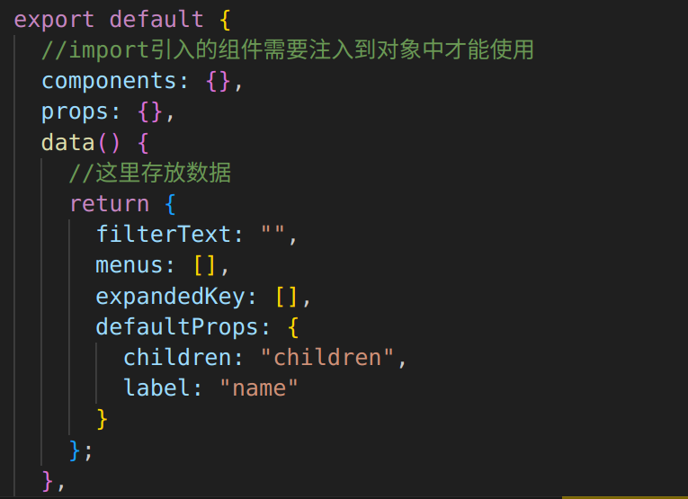

getMenus()获取三级分类。数据填入menus

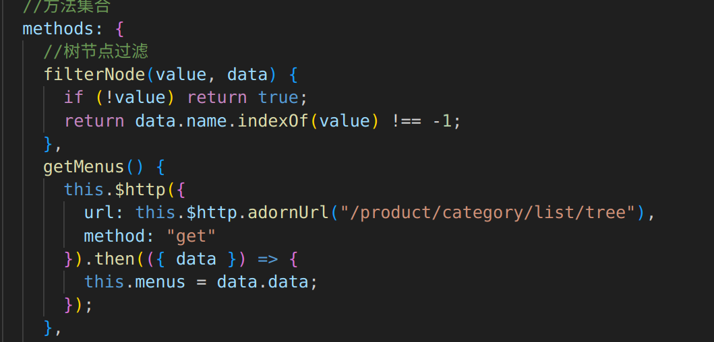

#### 父子组件

在  attrgroup.vue 中导入组件

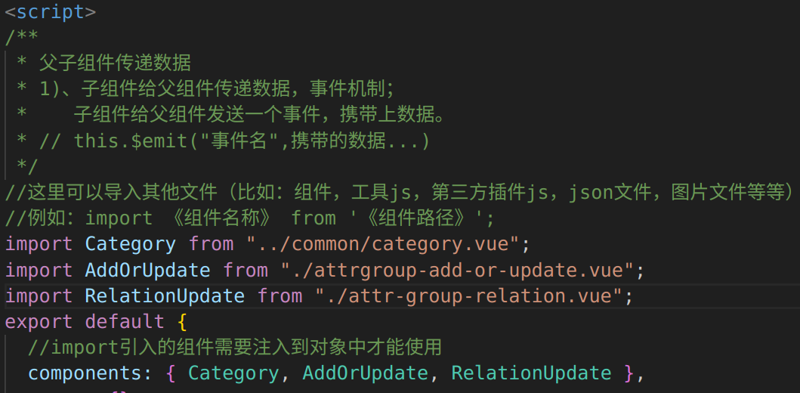

#### 右边表格

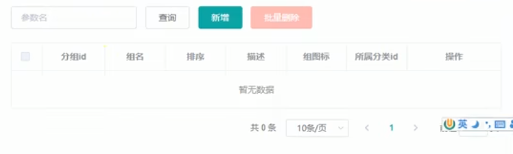

###  属性分组功能

#### 1

当我们点击第三级分类，会在右边出现查询到的属性信息

问题：

怎样让树形组件感知到点击事件？怎样查询，并在attrgroup.vue的前端el-table表格中显示出来？

解决：父子组件通信

父组件：attrgroup.vue

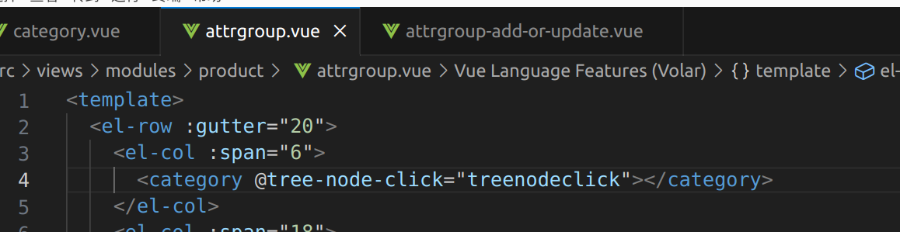

引用了category.vue

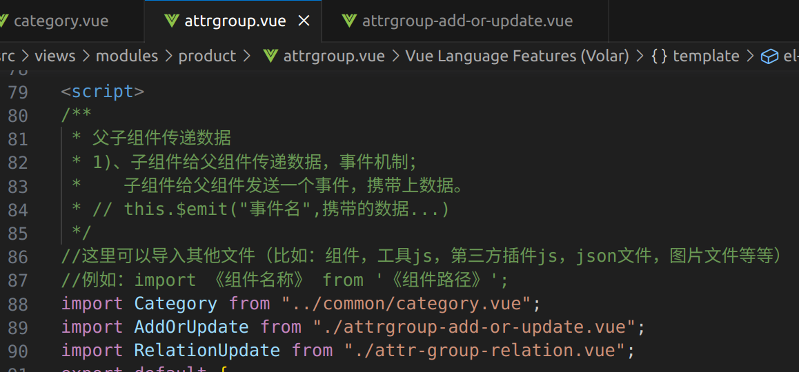

官方文档

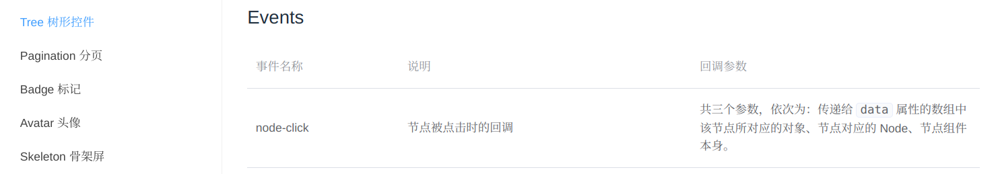

methods中 三个参数


#### 2  获取分类属性分组

接口文档：

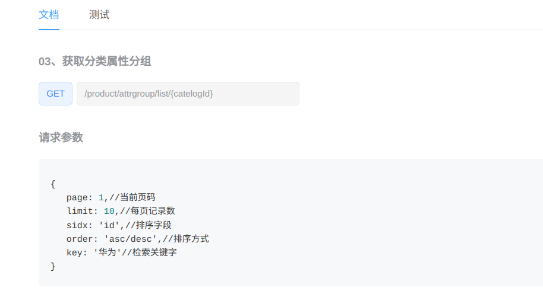

数据库表：


后端实现：

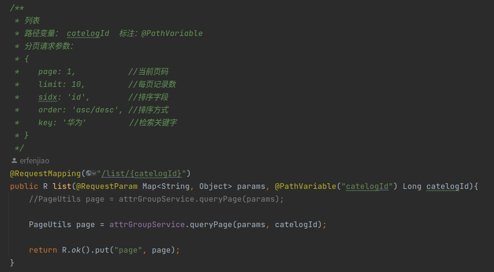


#### 3 新增中的分类选择

级联选择器

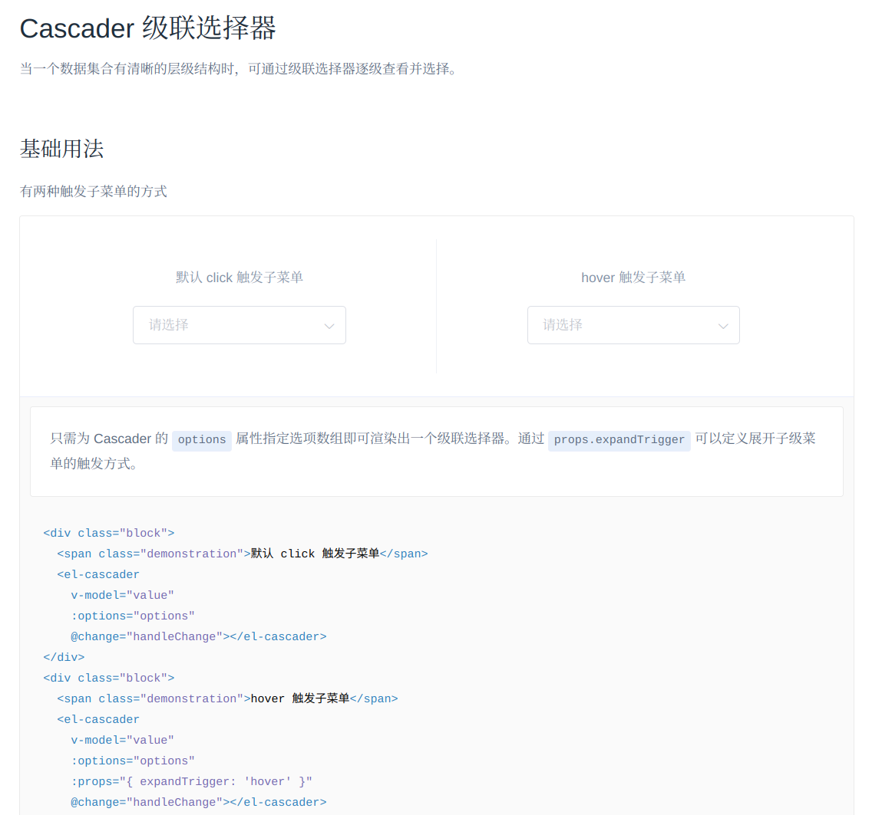

前端代码添加级联选择器

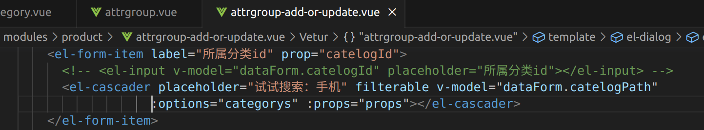

注意：

1. :options 中使用 categorys 数组
2. 设定 :options 的value label childern值，否则不能正确显示出数据

