# 属性分组

## 前端组件抽取 && 父子组件交互

### 三级分类后端接口


### 属性分组前端

左右布局。左边三级分类，右边查询


```
<el-row> 
```


#### 左边三级分类

/views/modules/common/category.vue

el-tree 中，使用catId区分节点，el-tree组件名字叫做menuTree


data 数据结构体如下：


getMenus()获取三级分类。数据填入menus


#### 父子组件

在  attrgroup.vue 中导入组件


#### 右边表格


###  属性分组功能

#### 1 父子组件通信

当我们点击第三级分类，会在右边出现查询到的属性信息

问题：

怎样让树形组件感知到点击事件？怎样查询，并在attrgroup.vue的前端el-table表格中显示出来？

解决：父子组件通信

父组件：attrgroup.vue


引用了category.vue


官方文档


methods中 三个参数

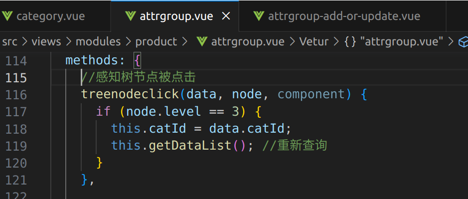

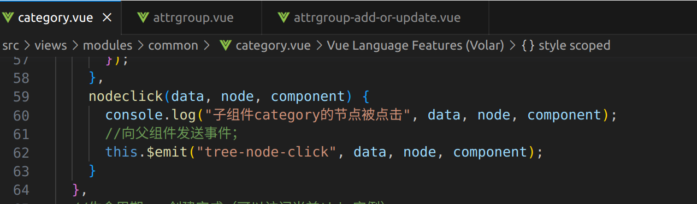

#### 2  获取分类属性分组

接口文档：


数据库表：

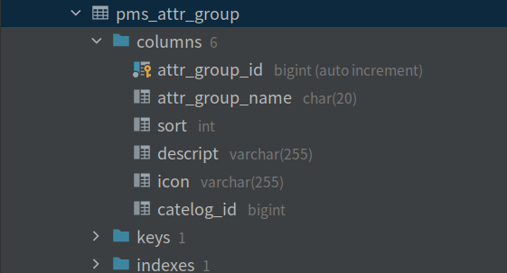

后端实现：

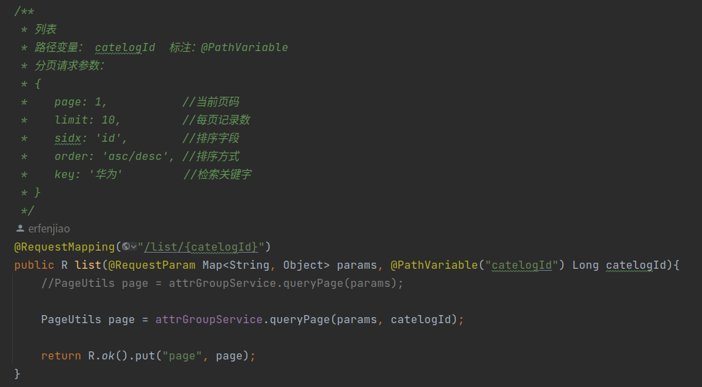

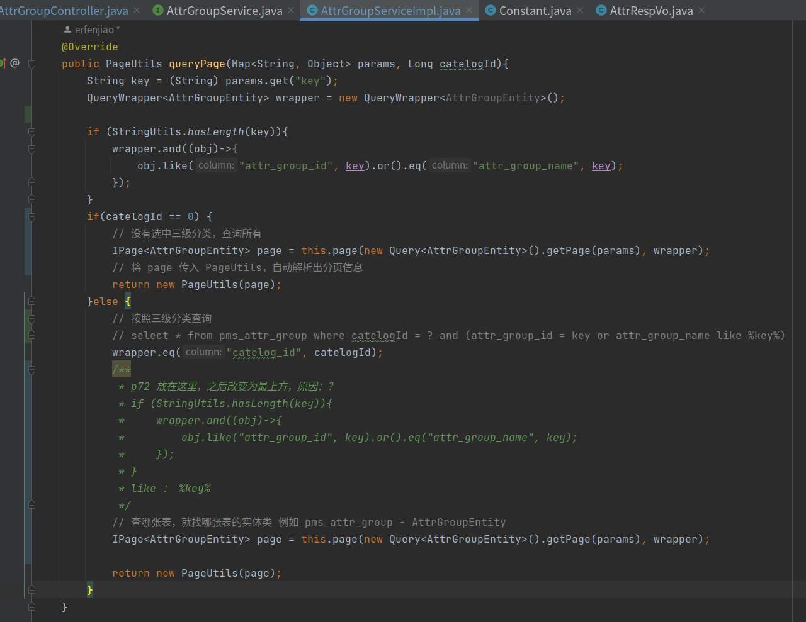

#### 3 新增中的级联选择器

级联选择器


前端代码添加级联选择器

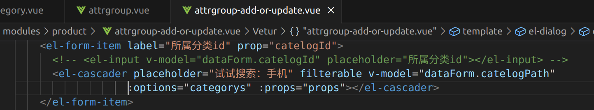

注意：

##### 注意点1

:options 中使用 categorys 数组


##### 注意点2

设定 :options 的value label childern值，否则不能正确显示出数据


##### 注意点3

第三级分类下没有childern[]集合了，但是还是显示空白

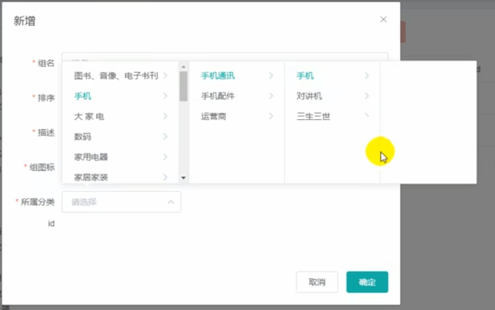

CategoryEntity.java 中：添加NON_EMPTY，表示children字段返回时不为空时才带

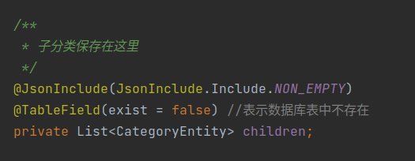


##### 注意点4

catelogId 包括了当前节点和它的父节点Id，但数据库返回时只需要当前节点的 Id

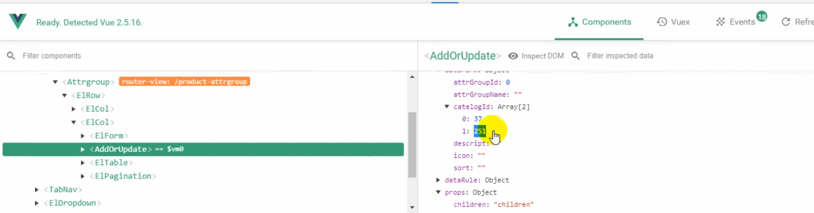


提交后刷新页面：

子组件给父组件attrgroup.vue发送事件


父组件


##### 注意点5

点击修改，所属分类并没有回显

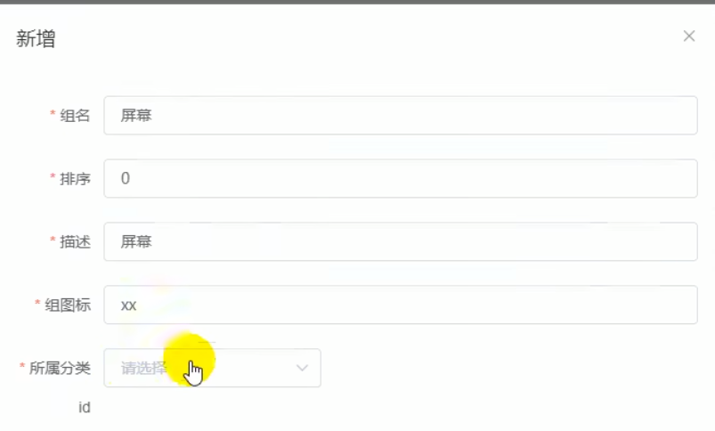

原因：回显是层级关系，之前为了向数据库提交，只保存了当前节点自己的 categoryId ，所以回显就无法显示完整的路径

查看修改按钮代码，点击事件：addOrUpdateHandle

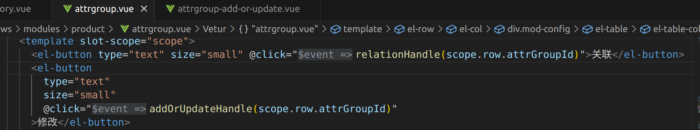

此事件调用addOrUpdate组件，给此组件传入id

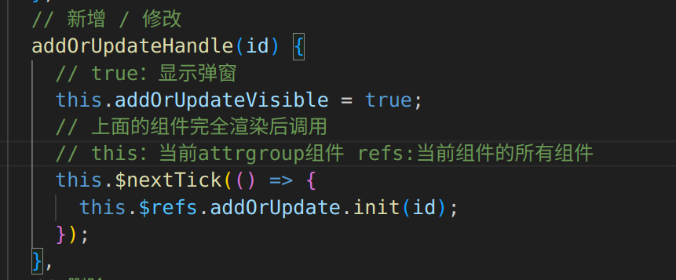


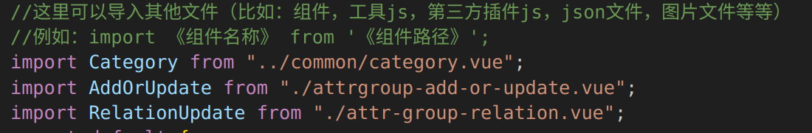

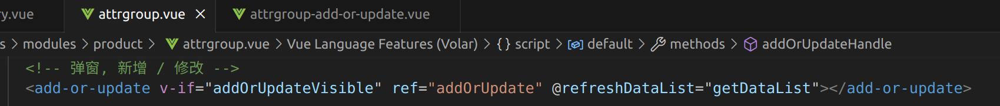

找到 init 方法，在 dataForm 中添加 catelogPath ，查出完整路径

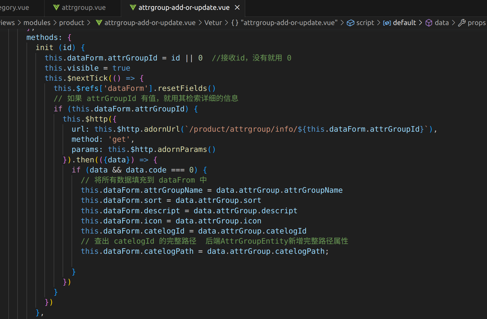

数据中也添加


后台中也添加。在AttrGroupEntity.java 中添加

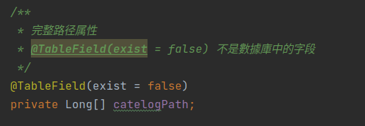

添加 findCatelogPath() 方法

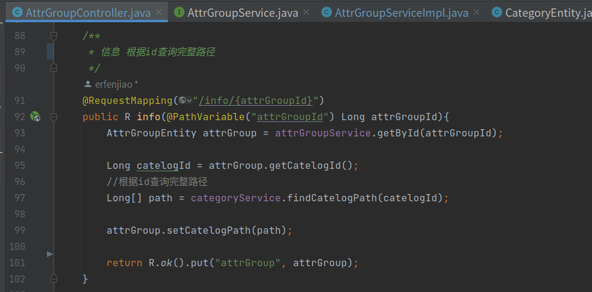

实现：

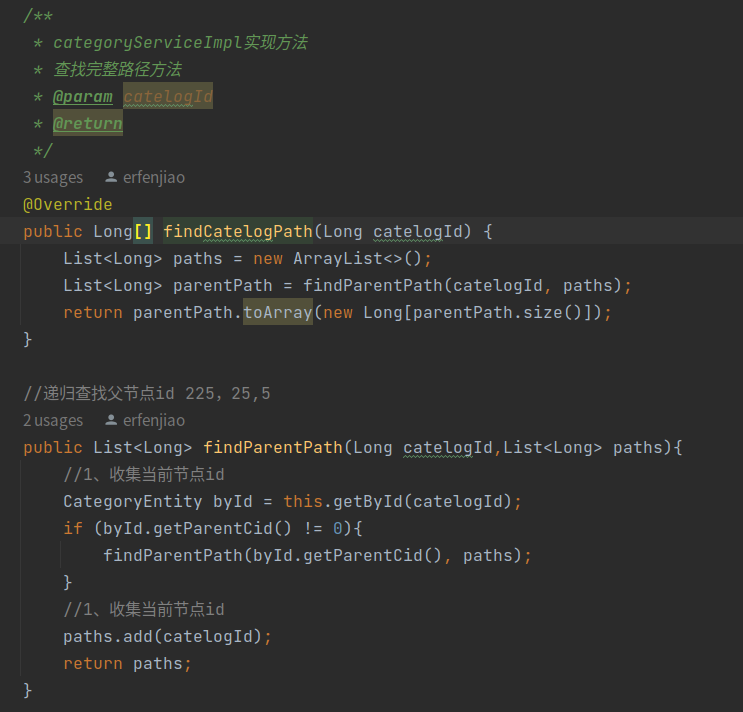

##### 注意点6

使级联框可搜索

在 <el-cascader> 中添加 filterable
