# 1

属性分组中，查询所有时，没有附带关键字查询

在 AttrGroupController.java 中修改

# 2

属性分组中，规格参数中有基本信息，我们需要录入一些数据

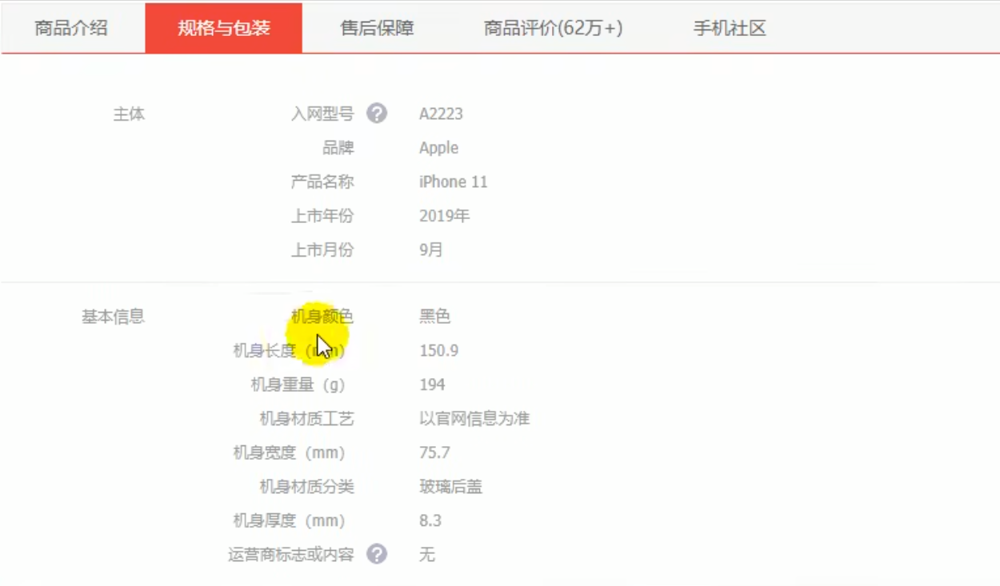

## 新增

于是先调试新增功能

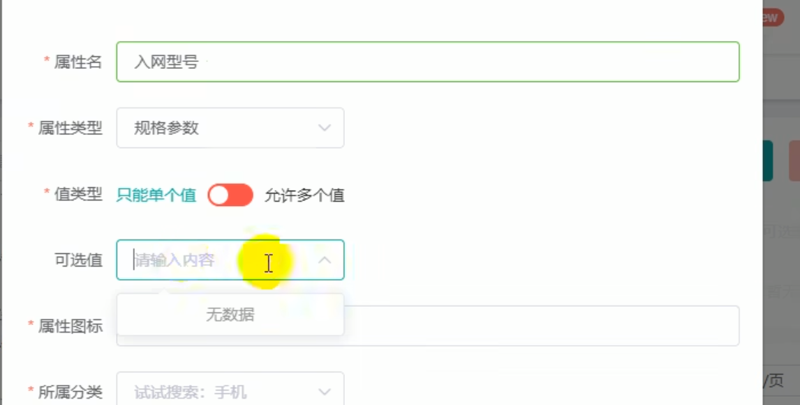

属性类型选择规格参数

可选值可以提前录入数据，这里选择即可；也可以填写一些数据

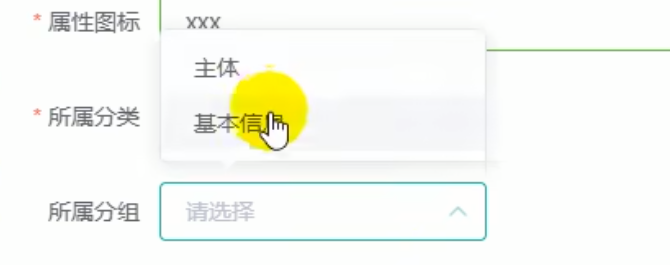

所属分组是获取当前分类下的所有属性分组

选择完成后保存，使用的是逆向生成的保存代码，但是并没有保存完全，如图，没有跟属性的分组关联起来

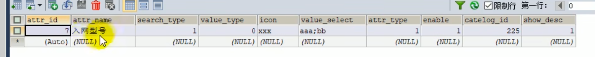

在pms_attr_attrgroup_relation中没有保存信息

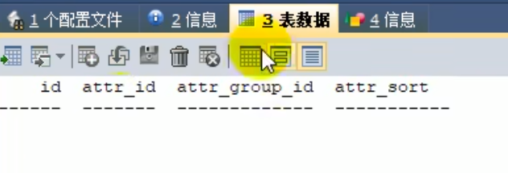

同样的，在前端提交的数据中还多了一个attrGroupId


Entity中定义的字段都与数据库表中的字段一一对应，称为PO

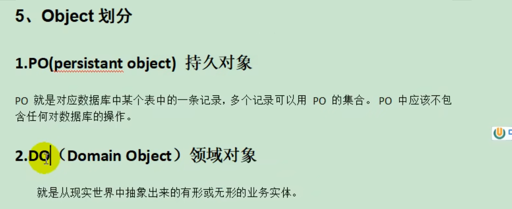

### DAO

用于访问数据库的对象

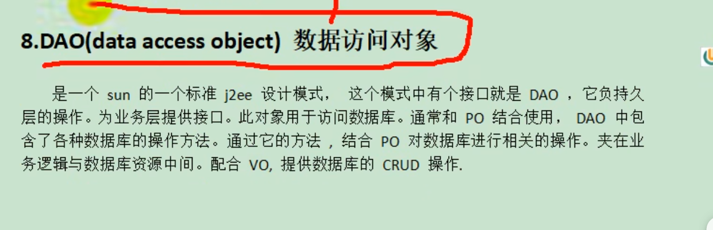

### VO

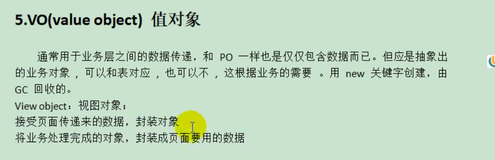

### 保存信息

#### 保存基本信息

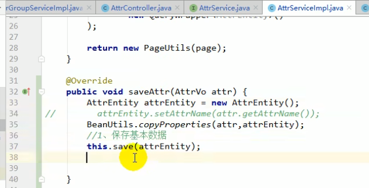

#### 保存关联关系

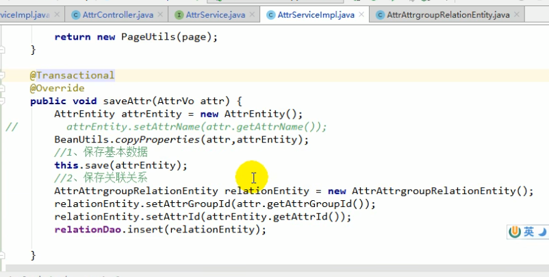


添加数据

例如新增一个上市年份，所属分组选主体

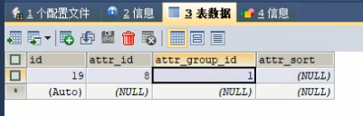

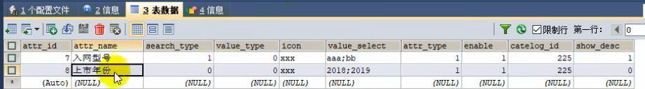


### 查询规格参数列表

接口文档

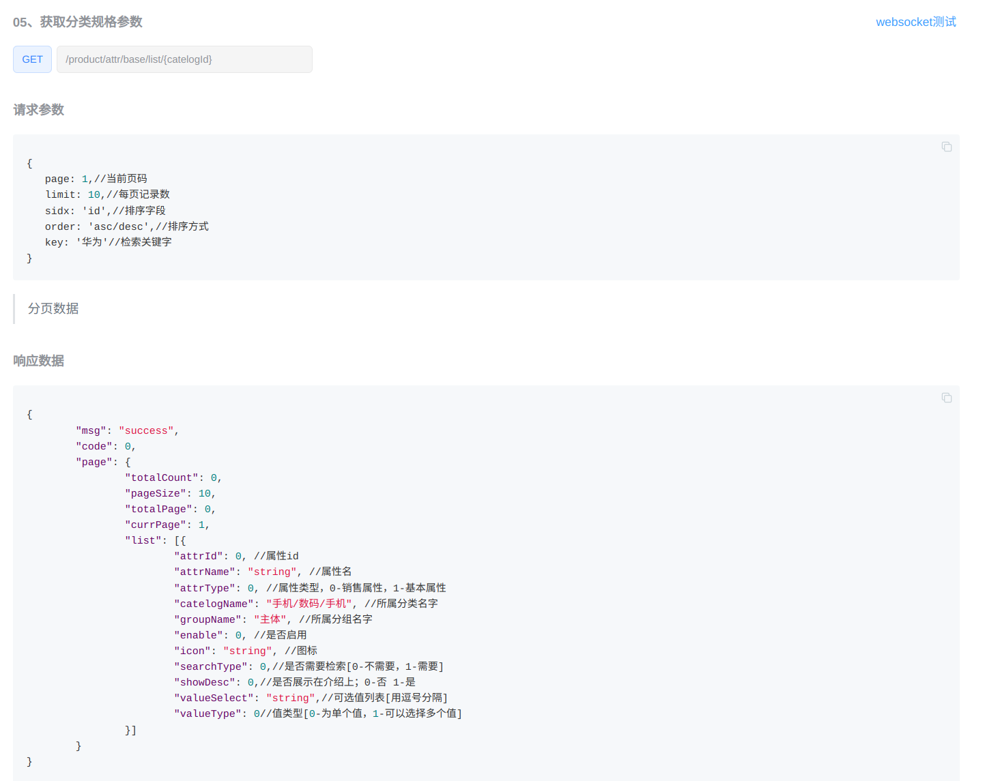


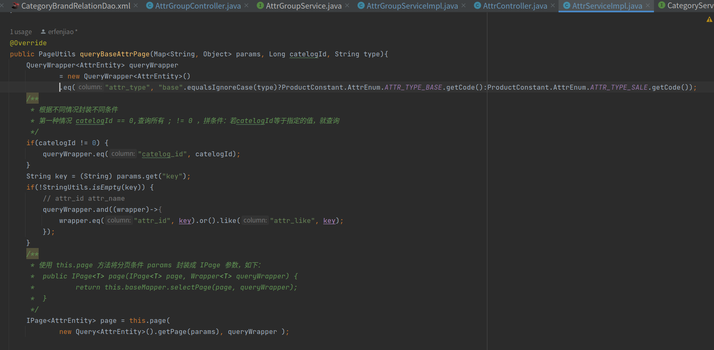

还需要所属分类和所属分组：


接口文档中也存在：

```c
"catelogName": "手机/数码/手机", //所属分类名字
"groupName": "主体",            //所属分组名字
```


由此，我们需要 AttrRespVo，它是用来做响应的